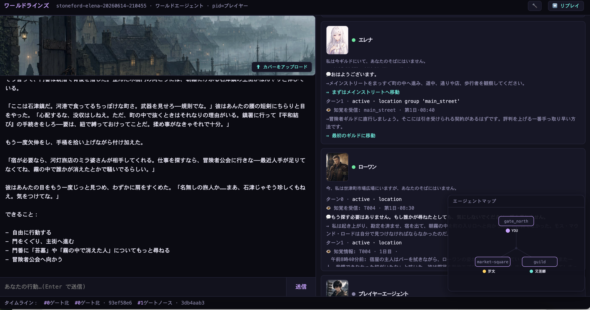

# WorldLines

**Language:** [English](./README.md) · [简体中文](./README.zh.md) · [日本語](./README.ja.md) · [한국어](./README.ko.md)

> **オープンソース:** このリポジトリのサンプルワールドとツール — AGPL-3.0。フォーク、改変、自分の世界を自由に公開できます。
> **オープンソースではない:** エンジンコア(`neonrp`)。プレイは自由、フォークや再配布は不可。[LICENSE](LICENSE) 参照。

<p align="center">
  
  
  
  
  <a href="https://hub.worldlines.gg"></a>
  
  
</p>

<p align="center">
  
</p>

## 概要

> たいていの AI ロールプレイが与えてくれるのは*会話する相手のキャラクター*です。WorldLines が与えるのは、**あらゆる AI が本当に生きている世界** —— あなたが足を踏み入れるリアルタイムのマルチエージェントシミュレーションで、ひとつひとつのソウルが固有の心・記憶・思惑を持っています。チャットではありません。ひとつの世界です。

**何ができるのか？**

あなたのすべての行動を覚えている世界に足を踏み入れよう。灰霧の北の港で包囲命令を下す。永遠に駅に着かない列車のすべての車両を探索する。あなたの言葉を本当に覚えている記憶喪失の癒し手と向かい合って座る。数分で世界を作り、そのルール、テンポ、NPC を設定するか、公開カタログから選んでそのまま飛び込む。これはリアルタイムのマルチエージェント社会：多くの AI ソウルとあなたが、ひとつの世界で、共に形づくる。

これはエージェント型シミュレーションエンジンです。ワールド agent が場所 agent につながり、場所 agent がソウル agent をホストします。全員が agent。あなたは分身端末で参加します。これはチャットボットでも、スクリプトゲームでもありません。

> ステータス: **v0.2.0 — Hub ローンチ**（2026-06）· [今すぐ遊ぶ →](https://hub.worldlines.gg)

---

## チームとビジョン

私たちは**東京大学**の PhD および研究者、そしてゲーム実務者からなる学際的チーム（社会学、経済学、コンピュータグラフィックス、AIエージェント、仮想世界）— **Ludic Dynamics** です。

TRPG、ギャルゲー、乙女ゲームに育ちました。AI が今のように普及する以前から、長年にわたり日本語文化翻訳のボランティア活動を続け、テーブルトークやゲームグラフィックスエンジンの世界に深く携わり、日本のビジュアルノベルの Steam 展開を支援してきました。パンデミック以降、私たちは AI ロールプレイとナラティブゲームの世界に没頭しました——週末のたびに、深夜までセッションを走らせ、世界を構築し、「物語が本当に息づく」感覚を追い続けてきました。

十を超える国々をまたいで時空を冒険し、異世界の失われた歴史を探り、大切な人を救うために何度も同じ一日に死に戻り、並行する時間線を辿って唯一の世界線を見つけ出し、歴史を召喚して理想をかけた戦いを戦い抜いてきました。

WorldLines はその執念から生まれました。

> **Orchestrated Reality · 編成された現実。** Harness を通じて世界と AI ソウルをシミュレート —— 世界には物理的一貫性が、NPC には認知的一貫性がある。エージェントをコードするな。エージェントで世界を編成せよ。

harness によって「マルチエージェント × ワールド × ソウル」のシステムを構築しました。このエンジンで実現したいこと：**インタラクティブ体験創造 · マルチエージェント社会実験 · エージェント研究推進 · 人格・世界モデルのベンチマーク。**

> **Agent Role Play。** 人々はすでに Claude Code や Codex の中で直接ロールプレイしています —— エージェント型システムにキャラクターとシーンを動かさせて。それはプロンプトベースのチャットを超えた新しいパラダイムであり、私たちが目指しているのはまさにそこです。WorldLines はその同じエージェントの筋力を、**より速く、モデル非依存（DeepSeek / OpenRouter / ローカル / 無料モデルで動かせる）、そしてスケールするマルチエージェント**にします —— ソウルたちが本当に息づく、生きてプレイできる世界へと変えるのです。

---

## デモ & 動画

<p align="center">
  <a href="https://youtu.be/M_0xX8OZMa0">
    
  </a>
</p>
<p align="center"><em>▶ YouTube でデモを観る</em></p>

---

## クイックスタート

### 🖥️ ランチャーをダウンロード

お使いのプラットフォームを選んでください。ダブルクリックでインストール。ターミナル不要。

| プラットフォーム | ファイル | ダウンロード |
|----------|------|----------|
| macOS | `WorldLines.command` | [最新版](https://worldlines.gg/WorldLines.command) |
| Windows | `WorldLines.bat` | [最新版](https://worldlines.gg/WorldLines.bat) |
| Linux | `WorldLines.sh` | [最新版](https://worldlines.gg/WorldLines.sh) |

macOS / Linux: `chmod +x` を一度実行し、デスクトップにドラッグ。

### ⌨️ またはターミナルでインストール

```bash
# macOS / Linux
curl -LsSf https://worldlines.gg/install.sh | sh

# Windows（PowerShell）
irm https://worldlines.gg/install.ps1 | iex
```

インストール後：

```bash
worldlines
```

TUI が起動します。ここから新規ワールドの作成、カタログの閲覧、保存済みセッションの続行が可能です。

> **初回起動時に API 設定を案内します。** キーは `~/.neonrp/config.json` に保存。 [プロバイダーガイド →](https://docs.worldlines.gg/docs/getting-started/quickstart)

### 🌐 またはブラウザで遊ぶ

インストール不要。**[hub.worldlines.gg](https://hub.worldlines.gg)** を開き、サインインしてブラウザで遊ぶ。

---

## スクリーンショット

<p align="center">
  
</p>
<p align="center"><em>マルチエージェントの村、ライブ(Stoneford · Elena)—— Elena と Rowan がそれぞれ知覚し、考え、自分の意思で動く。world-agent が語り、エージェントマップが誰がどこにいるかを示す。</em></p>

<p align="center">
  
</p>
<p align="center"><em>霧のなか Stoneford に到着。</em></p>

---

## サンプルワールド

WorldLines は世界を **3 つのエンジンモード**のいずれかで動かします —— これらは**混用できません**:

- **fast** —— 一つの高速 agent、単一の声。
- **orch** —— world-agent がドメイン agent（町 / ダンジョン / 戦闘 / 物語）を編成;NPC はデータ。
- **multi-agent** —— world-agent が**独立したソウル**を包む。各ソウルは固有の心・記憶・思惑を持つキャラクター agent。目印は `souls/` フォルダ。*今回の新リリース。*

### 👥 multi-agent —— 独立したソウルが一つの世界に

> **ローカル実行。** multi-agent はまだホストプレイ非対応（オンラインは `fast` + `orch` のみ）。**Launcher** で遊ぶ(新規ゲーム → ワールドを選ぶ → **ブラウザ · Web**)か、`neonrp web --project examples/multi-agent/<world>` —— multi-agent はブラウザが一番、一人ひとりのソウルが生きる様子を見られます。**初めてですか？Stoneford · Elena から。**(スクリプト/研究用は `neonrp play --project … --json --trace`。)

| ワールド | ソウル | 実行 |
|---|---|---|
| **[神楽島 Kagura Island](./examples/multi-agent/kagura-island)** | **7 体** —— 鏡子 · 羽 · 真琴 · 宮司 · 白 · 翼 · 悠人。和風ミステリー、タイムループ、CoC 判定。最も豊かなマルチエージェント社会。 | [ソース →](./examples/multi-agent/kagura-island) |
| **[Stoneford · Elena](./examples/multi-agent/stoneford-elena)** | **2 体** —— Elena（覚えている癒し手）+ Rowan。Stoneford の世界に生きたソウルが宿る。 | [ソース →](./examples/multi-agent/stoneford-elena) · [Elena と話す（ホスト）](https://hub.worldlines.gg/play/souls/elena) |

### ⛩ Stoneford — 旗艦 orch ワールド

灰霧の北の河港。クラシックファンタジー TRPG · d20 ダイス · **10-agent 編成の村** —— 中心の world-agent が町・ダンジョン・戦闘・物語・NPC agent にルーティング。**[オンラインで遊ぶ →](https://hub.worldlines.gg/play/worlds/stoneford)** · **[ソース & ドキュメント →](./examples/orch/stoneford)**

### その他のワールド

| ワールド | プレイスタイル | ライブデモ |
|---|---|---|
| **Dark Train** | オープンワールド — 何をしても世界が覚えている | [遊ぶ →](https://hub.worldlines.gg/play/worlds/dark-train) |
| **Goblin Ambush** | 3 層ダンジョン — 3 体のゴブリンボスを倒せ | [ソース →](./examples/orch/goblin-ambush) |
| **Worldline** | 時間漂流ナラティブ — 過去にテキストを送る | [ソース →](./examples/orch/worldline) |
| **Sakura Hallway** | 学園ラブストーリー · 感情叙事 | [ソース →](./examples/orch/sakura-hallway) |

すべてのワールドは [examples/](./examples/) にあります — オープンソース（AGPL-3.0）。

### クイック実行

```bash
# multi-agent —— 村（neonrp play が専用ランナー）
neonrp web --project examples/multi-agent/stoneford-elena   # 2 体のソウル —— Elena & Rowan  ← ここから
neonrp web --project examples/multi-agent/kagura-island     # 7 体のソウル —— 和風ミステリー

# orch（neonrp tui）
neonrp tui --from examples/orch/stoneford           # 旗艦 包囲 TRPG
neonrp tui --from examples/orch/dark-train          # オープンワールド
neonrp tui --from examples/orch/goblin-ambush/zh    # 3 層ダンジョン
neonrp tui --from examples/orch/sakura-hallway/zh   # 学園ナラティブ
```

---

## このエンジンを使った他のプロジェクト

- **[Soul Talk](https://hub.worldlines.gg/play/souls/elena)** — キャラクターエージェント対話シーン。Elena は覚えている。
- **[Worldline](./examples/orch/worldline)** — 時間漂流ナラティブエンジン。過去にテキストを送り、時間線の書き換えを見る。
- **Coming: RP-Abyss** — TRPG 遠征。DM + ダイス判定。

---

## 誰のためのものか

### 🎮 AI ロールプレイプレイヤー

**Character.AI、SillyTavern、AI 酒場**から来たあなた。深いキャラクター会話が好き —— でも世界はいつも忘れてしまう。

WorldLines は**本当の記憶**を持つキャラクターを提供します。3 セッション前のあなたの言葉を覚えています。内なる声、意図、目標を持っています。そして彼らは孤独ではありません —— 他のキャラクターと共に世界に生き、互いに覚えています。

→ [Soul Talk をプレイ](https://hub.worldlines.gg/play/souls/elena) · [AI キャラクターカードを世界に持ち込む](https://docs.worldlines.gg/docs/guides/sillytavern-import)

### 📖 ギャルゲー · 乙女ゲーム · ビジュアルノベルファン

**Ren'Py、TyranoBuilder、分岐ナラティブ**が好き —— でもすべてのルートを手書きするのに疲れた。応答する物語が欲しい、分岐するだけじゃなく。

WorldLines ではキャラクター、世界のルール、トーンを設定すれば、エージェントがリアルタイムでストーリーを生成します。すべての選択が波紋を広げます。同じプレイスルーは二度とありません。

→ [Sakura Hallway をプレイ](./examples/orch/sakura-hallway)（学園ラブストーリー）· [初めての世界を作る](https://hub.worldlines.gg/create/world) · *ビジュアルノベル専用のオープンソースプロジェクト —— 近日公開*

### ✍️ TRPG GM & ワールドクリエイター

**Foundry VTT、Discord、紙とペン**で卓上キャンペーンを回している。プレイ時間より準備時間の方が長い。

WorldLines は GM のエンジンです：制約を設定すれば —— ルール、NPC、トーン —— エージェントが世界を動かします。自動インデックス化されたロア、NPC ごとの記憶、ダイスレフェリーエージェント。

→ [クイックスタート](https://docs.worldlines.gg/docs/getting-started/quickstart) · [Stoneford スターターワールド](./examples/orch/stoneford)

### 🔬 研究者 — AI パーソナリティ · 世界モデル · マルチエージェント

人格モデル、世界モデルベンチマーク、マルチエージェント社会を研究している。**再現可能なサンドボックス**が必要 —— ブラックボックス API ではなく。

WorldLines は**ファイルベース、イベントソース、git-diffable**。すべてのエージェントの意思決定、すべての世界状態の変化がプレーンテキストのイベントとして追跡・再生・測定可能です。

多人数の同時プレイはまだ準備中 —— ですが**マルチエージェントの村**が今日の基盤です:実行・スクリプト化・再現が可能な、独立したソウルの社会。`neonrp play` がマルチエージェント専用ランナーで、スクリプト可能な JSON + trace 出力に対応:

```bash
neonrp play --project examples/multi-agent/kagura-island                 # インタラクティブ REPL
neonrp play "..." --project examples/multi-agent/kagura-island --json --trace   # ワンショット、スクリプト可
```

マルチエージェントのチュートリアルは近日公開。**研究ニーズがありますか?[Issue を立てる](https://github.com/LudicDynamics/WorldLines/issues) か `info@worldlines.gg` へ —— あなたの実験に協力します。**

→ [マルチエージェントモード](https://docs.worldlines.gg/docs/core-concepts/engine-modes#multi-agent) · [コアコンセプト](https://docs.worldlines.gg/docs/core-concepts/agents-orchestration) · [仕組み](#how-it-works)

### 🛠️ 開発者

**Claude Code、LangGraph、またはカスタムエージェントパイプライン**で構築している。world-agent・soul-agent・player-agent が実際どう噛み合うのかに興味がある。

私たちは**まだプロトコルをオープンソース化していません** —— **world-agent · soul-agent · player-agent** のアーキテクチャはまだ反復中です。唯一の完璧な答えがあるとは考えておらず、より洗練された設計を能動的に研究しています。サンプルワールドは**オープン**（AGPL-3.0）—— ワールドをフォークし、エージェントを改造し、どう配線されているか調べてください。

これがあなたの取り組みたい問題なら、**[Discord に参加](https://discord.gg/HJYWbdqWrE)** して一緒にアーキテクチャを形づくりましょう。

→ [examples/](./examples/) · [仕組み](#how-it-works)

## 仕組み

WorldLines はゲーム世界をファイルベースのイベントソース型ステートマシンとして扱います。すべてのターンは追記専用のイベント。スナップショットで高速な巻き戻しが可能。

**エージェントアーキテクチャ（3 層）:**

```
Layer 1: world-agent        — 状態 · ルーティング · ナラティブ · アーカイブ
Layer 2: town-agent          — NPC、商店、ナビゲーション
         dungeon-agent       — 探索
         combat-referee      — d20 ダイス
         world-builder       — マップ更新
Layer 3: (将来) ダイス/ルール ツールエージェント
```

- **ファイル永続化された記憶と世界状態** — すべてがプレーンな JSON と Markdown としてディスク上に。
- **自動インデックス・自動注入コンテキスト** — 手動のロアブック管理不要。
- **ブランチ / アンドゥ / リドゥ** — git ブランチのように物語の分岐を探索。
- **サンドボックス & リプレイ** — 決定性を検証。
- **ローカルファーストモデル** — GLM、OpenAI、LM Studio、Ollama。

---

## 論文と引用

WorldLines を支えるフレームワーク **Orchestrated Reality** は、人間プレイヤーのための LLM 駆動ゲーム世界を *Parameterized-Action POMDP* として定式化し、Plan–Diff–Validate–Apply パイプラインでスキーマ検証済みの JSON 差分をコミットします。

> **[Orchestrated Reality: From Role-Play to Living, Playable Game Worlds](https://arxiv.org/abs/2606.16014)**
> Yuhang Huang, Chenmiao Li, Chaowei Fang. arXiv:2606.16014 (2026).

```bibtex
@misc{huang2026orchestrated,
  title         = {Orchestrated Reality: From Role-Play to Living, Playable Game Worlds},
  author        = {Huang, Yuhang and Li, Chenmiao and Fang, Chaowei},
  year          = {2026},
  eprint        = {2606.16014},
  archivePrefix = {arXiv},
  primaryClass  = {cs.AI},
  url           = {https://arxiv.org/abs/2606.16014}
}
```

---

## チュートリアル

完全なドキュメントは **[docs.worldlines.gg](https://docs.worldlines.gg)** に：

| トピック | リンク |
|---|---|
| はじめに | [docs.worldlines.gg/docs/getting-started](https://docs.worldlines.gg/docs/getting-started) |
| コアコンセプト | [docs.worldlines.gg/docs/core-concepts](https://docs.worldlines.gg/docs/core-concepts) |
| ガイド | [docs.worldlines.gg/docs/guides](https://docs.worldlines.gg/docs/guides) |
| Q&A / 比較 | [docs.worldlines.gg/docs/qa](https://docs.worldlines.gg/docs/qa) |

---

## ロードマップ

| バージョン | ステータス |
|---|---|
| **v0.1.9** — Engine (2026-04) | ✓ 10-agent オーケストレーター · Stoneford スターター · Claude Code ランタイム |
| **v0.2.0** — Hub ローンチ (2026-06) | ✓ WebHub · ホストプレイ · Soul Talk · Create Studio · Stripe · カバー · セーブ |
| **v0.2.3** — Multi-Agent Village (2026-06) | ✓ 村モデル：world-agent が独立した souls を包む · Kagura Island · Stoneford · Elena · ローカル実行 |
| **v0.3.0** — Desktop (2026-07) | ◑ Tauri デスクトップ · 常駐ワールド · Alipay/WeChat · セルフホスト Web 版 |
| **v1.0** — Protocol | ○ 安定した WORLD/SOUL プロトコル · セルフホスト Web 版 |

完全なロードマップ: [docs.worldlines.gg/docs/roadmap](https://docs.worldlines.gg/docs/roadmap)

---

## ライセンス

**オープンソース（AGPL-3.0）:** `examples/` と `tools/` のサンプルワールド、キャラクターバンドル、ツール。（エージェントのプロトコル/アーキテクチャはまだ反復中で、未オープンソース化 —— 上記「開発者」を参照。）

**オープンソースではない:** エンジンコア（`neonrp`）。プロプライエタリプレビュー — プレイは自由、フォークは不可。

## スター履歴

<p align="center">
  <a href="https://www.star-history.com/?type=date&repos=LudicDynamics%2FWorldLines">
    <picture>
      <source media="(prefers-color-scheme: dark)" srcset="https://api.star-history.com/chart?repos=LudicDynamics/WorldLines&type=date&theme=dark&legend=top-left" />
      <source media="(prefers-color-scheme: light)" srcset="https://api.star-history.com/chart?repos=LudicDynamics/WorldLines&type=date&legend=top-left" />
      
    </picture>
  </a>
</p>

---

## コミュニティ

- Web: [worldlines.gg](https://worldlines.gg) · Docs: [docs.worldlines.gg](https://docs.worldlines.gg)
- Discord: [discord.gg/HJYWbdqWrE](https://discord.gg/HJYWbdqWrE)
- GitHub: [LudicDynamics/WorldLines](https://github.com/LudicDynamics/WorldLines)
- 連絡先: `info@worldlines.gg`

---

**nikoloside** & **redoctober** が開発、[Ludic Dynamics](https://ludicdynamics.com) と共に推進。
