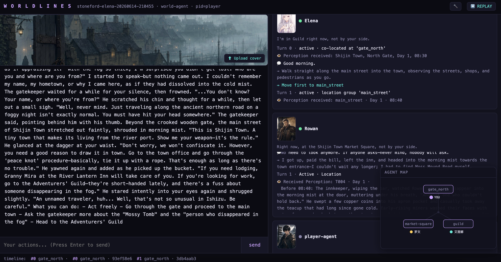
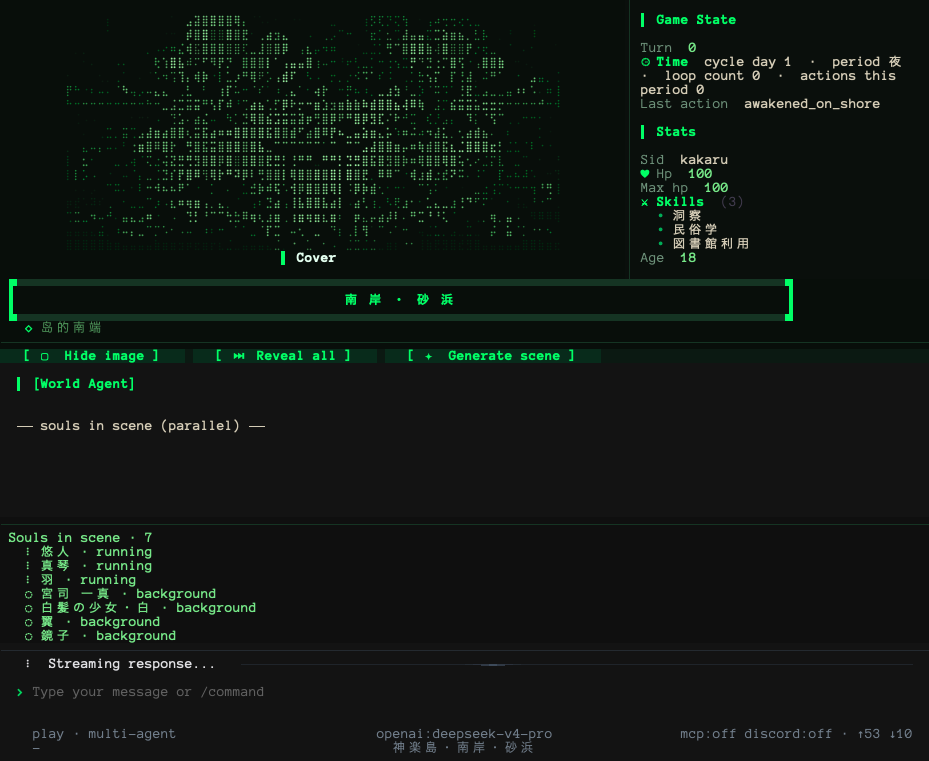

# WorldLines

**Language:** [English](./README.md) · [简体中文](./README.zh.md) · [日本語](./README.ja.md) · [한국어](./README.ko.md)

> **What's open:** the example worlds and tools in this repo — AGPL-3.0. Fork, modify, and ship your own worlds.
> **What's not:** the engine core (`neonrp`). Free to play, not free to fork or redistribute. See [LICENSE](LICENSE).

<p align="center">
  
  
  
  
  <a href="https://hub.worldlines.gg"></a>
  <a href="https://arxiv.org/abs/2606.16014"></a>
  
  
</p>

<p align="center">
  
</p>

## Overview

> Most AI role-play gives you a *character to chat with*. WorldLines gives you a **world where every AI genuinely lives** — a real-time multi-agent simulation you step into, where each soul has its own mind, memory, and agenda. Not a chat. A world.

**What can you do with it?**

Step into a world that remembers everything you do. Give siege orders in a grey-fog northern port. Sit across from an amnesiac healer who really remembers every word you say. Create a world in minutes — set its rules, its pace, its NPCs — or browse a public catalog and jump straight in. This is a multi-agent society running in real time: many AI souls and you, in one world, shaping it together.

WorldLines is a **multi-agent simulation engine for role-play**: the world is a society of independent agents. A world-agent owns the world and orchestrates a cast of **soul-agents** — every character is its own agent with a private mind, memory, and agenda, not a line of dialogue data. You join through an avatar terminal. This is not a chatbot, not a scripted game.

> Status: **v0.2.0 — Hub Launch** (2026-06) · [Play now →](https://hub.worldlines.gg)

---

## Team & Vision

We are **Ludic Dynamics** — a cross-disciplinary team of PhDs and researchers from the **University of Tokyo**, together with game industry practitioners. Our backgrounds span sociology, economics, computer graphics, AI agents, and virtual worlds.

We grew up on TRPGs, galgames, and otome games. Long before AI became what it is today, we spent years volunteering in Japanese cultural translation, working deep in the tabletop and game-graphics-engine industry, and helping Japanese visual novels launch on Steam. When the pandemic hit, we fell into AI role-play and narrative games — every weekend, every late night, running sessions, building worlds, chasing the feeling of a story that *really breathes*.

We have crossed time and space, adventuring across a dozen countries. We have explored the lost histories of other worlds, died and returned to a single day again and again to save someone precious, threaded through parallel timelines to find the one true world-line, and summoned the past to fight one last idealistic war.

WorldLines is what came out of that obsession.

> **Orchestrated Reality.** Through the Harness, we simulate worlds and AI souls — with physical consistency in the world, and cognitive consistency in every NPC. Don't code the agent. Use the agent to orchestrate the world.

We built a harness that connects world-agents, place-agents, and soul-agents into one living simulation. We want this engine to power: **interactive-experience creation · multi-agent society experiments · agent-research advancement · personality-model and world-model benchmarks.**

> **Agent Role Play.** People already role-play directly inside Claude Code and Codex — letting an agentic system drive characters and scenes. That's a new paradigm beyond prompt-based chat, and it's the one we're building for. WorldLines takes that same agentic muscle and makes it **faster, model-agnostic (run it on DeepSeek / OpenRouter / local / free models), and multi-agent at scale** — turning it into a living, playable world where the souls actually come alive.

---

## Demo & Video

<p align="center">
  <a href="https://youtu.be/M_0xX8OZMa0">
    
  </a>
</p>
<p align="center"><em>▶ Watch the demo on YouTube</em></p>

---

## Quick Start

### 🖥️ Download the desktop app

Double-click to install — it bootstraps the engine on first launch and opens
the full local web product. No terminal needed.

| Platform | File | Download |
|----------|------|----------|
| macOS (Apple Silicon) | `WorldLines-Installer.dmg` | [latest](https://github.com/LudicDynamics/WorldLines/releases/latest/download/WorldLines-Installer.dmg) |
| Windows | `WorldLines-Desktop-windows-x64-setup.exe` | [latest](https://github.com/LudicDynamics/WorldLines/releases/latest/download/WorldLines-Desktop-windows-x64-setup.exe) |

macOS: right-click the installer → Open → Open — it downloads and installs
the desktop app; afterwards WorldLines opens with a normal double-click.
Windows: SmartScreen → More info → Run anyway. Linux uses the terminal
install below.

### ⌨️ Or install via terminal

```bash
# macOS / Linux
curl -LsSf https://worldlines.gg/install.sh | sh

# Windows (PowerShell)
irm https://worldlines.gg/install.ps1 | iex
```

Then:

```bash
worldlines
```

This launches the TUI. From there you can start a new world, browse the catalog, or jump into a saved session.

> **First run walks you through API setup.** Keys save to `~/.neonrp/config.json`. [Full provider guide →](https://docs.worldlines.gg/docs/getting-started/quickstart)

### 🌐 Or just play online

No install. Go to **[hub.worldlines.gg](https://hub.worldlines.gg)**, sign in, and play in the browser.

---

## Screenshots

<p align="center">
  
</p>
<p align="center"><em>The multi-agent village, live (Stoneford · Elena) — Elena and Rowan each perceive, think, and act on their own, the world-agent narrates, and the agent map tracks who's where.</em></p>

<p align="center">
  
</p>
<p align="center"><em>Multi-agent play (Kagura Island) — 7 souls in the scene; three reason in parallel this turn, the rest live on in the background.</em></p>

---

## Example Worlds

WorldLines **is a multi-agent simulation**: a world-agent wrapping a cast of **independent souls** — each a character-agent with its own mind, memory, secrets, and agenda (the tell-tale sign is a `souls/` folder). This is the engine, and where every world is heading.

> Lighter modes exist for simpler, single-thread scenes — `orch` orchestrates domain agents over data-driven NPCs, `fast` is a single-voice agent — but the heart of WorldLines is the multi-agent society below.

### 👥 The multi-agent society — independent souls in one world

> **Runs locally.** Multi-agent isn't on hosted play yet (hosted play offers `fast` + `orch`). Play it in the **Launcher** (New game → pick the world → **Browser · Web**) or `neonrp web --project examples/multi-agent/<world>` — multi-agent plays best in the browser, where you watch every soul live. **New here? Start with Stoneford · Elena.** (For scripting / research, `neonrp play --project … --json --trace`.)

| World | Souls | Run |
|---|---|---|
| **[Kagura Island](./examples/multi-agent/kagura-island)** | **7** — Kagami · Hane · Makoto · Miyaji · Shiro · Tsubasa · Yuto. Japanese-folk mystery, time loop, CoC checks. The richest multi-agent society. | [Source →](./examples/multi-agent/kagura-island) |
| **[Stoneford · Elena](./examples/multi-agent/stoneford-elena)** | **2** — Elena (the healer who remembers) + Rowan. The Stoneford world, now inhabited by living souls. | [Source →](./examples/multi-agent/stoneford-elena) · [Talk to Elena (hosted)](https://hub.worldlines.gg/play/souls/elena) |

### ⛩ Also: lighter `orch` / `fast` worlds

These run a world-agent voicing data-driven NPCs — no per-soul agents. Good for tighter, single-thread scenes, and the on-ramp to the full multi-agent society above.

**Stoneford** — a grey-fog northern river port. Classic-fantasy TRPG · d20 dice · a world-agent routing to town, dungeon, combat, and story agents. **[Play online →](https://hub.worldlines.gg/play/worlds/stoneford)** · **[Source & docs →](./examples/orch/stoneford)**

### More `orch` / `fast` worlds

| World | Play style | Live Demo |
|---|---|---|
| **Goblin Ambush** | 3-layer dungeon — fight through 3 boss goblins | [Source →](./examples/orch/goblin-ambush) |
| **Worldline** | Time-drift narrative — text the past | [Source →](./examples/orch/worldline) |
| **Sakura Hallway** | A school love story · emotional narrative | [Source →](./examples/orch/sakura-hallway) |
| **Lamp of Souls** (引魂灯·盛世缘) | 国风 otome court romance · 4 princes, a soul-lamp, 8 endings · zh | [Source →](./examples/orch/otome-lamp) |

All worlds live in [examples/](./examples/) — open-source (AGPL-3.0), fork and ship your own.

### Quick run

```bash
# multi-agent — the village (play in the browser: neonrp web)
neonrp web --project examples/multi-agent/stoneford-elena   # 2 souls — Elena & Rowan  ← start here
neonrp web --project examples/multi-agent/kagura-island     # 7 souls — Japanese-folk mystery

# orch (neonrp tui)
neonrp tui --from examples/orch/stoneford           # flagship siege TRPG
neonrp tui --from examples/orch/goblin-ambush/zh    # 3-layer dungeon
neonrp tui --from examples/orch/sakura-hallway/zh   # school-life narrative
```

Play online (hosted `fast`/`orch`): [Stoneford](https://hub.worldlines.gg/play/worlds/stoneford) · [Talk to Elena](https://hub.worldlines.gg/play/souls/elena). Multi-agent worlds (Kagura, Stoneford·Elena) run locally.

### Claude Code / MCP

Open Claude Code inside any world directory and the agents are there:

```
cd examples/orch/stoneford
claude
@world-agent 开始游戏
```

WorldLines exposes its agents as MCP tools. Claude Code discovers them
automatically — no extra setup. Each example ships with `.claude/agents/`
pre-configured.

---

## Other Projects Using This Engine

- **[Soul Talk](https://hub.worldlines.gg/play/souls/elena)** — character-agent dialogue scene. Elena remembers.
- **[Worldline](./examples/orch/worldline)** — time-drift narrative engine. Text the past, watch timelines rewrite.
- **Coming: RP-Abyss** — TRPG expedition. DM + dice checks.

---

## Who Is This For

### 🎮 AI Role-Play Players

You come from **Character.AI, SillyTavern, or AI Tavern**. You love deep character conversations — but the world always forgets.

WorldLines gives you characters with **real memory**. They remember what you said three sessions ago. They have inner voices, intentions, goals. And they're not alone — they live in a world with other characters who also remember.

→ [Play Soul Talk](https://hub.worldlines.gg/play/souls/elena) · [Bring an AI character card into a world](https://docs.worldlines.gg/docs/guides/sillytavern-import)

### 📖 Galgame · Otome · Visual Novel Fans

You love **Ren'Py, TyranoBuilder, and branching narratives** — but you're tired of writing every route by hand. You want stories that *respond*, not just branch.

WorldLines lets you set the characters, the world rules, and the tone — and the agents generate the story in real time. Every choice ripples. No two playthroughs are the same.

→ [Play Sakura Hallway](./examples/orch/sakura-hallway) (a school love story) · [Play Lamp of Souls](./examples/orch/otome-lamp) (a 国风 otome court romance) · [Create your first world](https://hub.worldlines.gg/create/world) · *a dedicated visual-novel open-source project — coming soon*

### ✍️ TRPG GMs & World Creators

You run tabletop campaigns in **Foundry VTT, Discord, or pen-and-paper**. You spend more time prepping than playing.

WorldLines is a GM's engine: you set the constraints — the rules, the NPCs, the tone — and the agents run the world for you. Auto-indexed lore, per-NPC memory, dice-referee agents.

→ [Quickstart](https://docs.worldlines.gg/docs/getting-started/quickstart) · [Stoneford starter world](./examples/orch/stoneford)

### 🔬 Researchers — AI Personality · World Models · Multi-Agent

You study personality models, world-model benchmarks, or multi-agent societies. You need a **reproducible sandbox** — not a black-box API.

WorldLines is **file-backed, event-sourced, and git-diffable**. Every agent decision, every world-state change, is a plain-text event you can trace, replay, and measure.

Large many-player co-op isn't ready yet — but the **multi-agent village** is the substrate today: a society of independent souls you can run, script, and reproduce. `neonrp play` is the dedicated multi-agent runner, with scriptable JSON + trace output:

```bash
neonrp play --project examples/multi-agent/kagura-island                 # interactive REPL
neonrp play "..." --project examples/multi-agent/kagura-island --json --trace   # one-shot, scriptable
```

A multi-agent tutorial is coming. **Have a research need? [Open an issue](https://github.com/LudicDynamics/WorldLines/issues) or email `info@worldlines.gg` — we'll work with your experiment.**

→ [Multi-agent mode](https://docs.worldlines.gg/docs/core-concepts/engine-modes#multi-agent) · [Core concepts](https://docs.worldlines.gg/docs/core-concepts/agents-orchestration) · [How It Works](#how-it-works)

### 🛠️ Developers

You build with **Claude Code, LangGraph, or custom agent pipelines**. You're curious how a world-agent, soul-agents, and a player-agent actually fit together.

We haven't open-sourced the protocol yet — the **world-agent · soul-agent · player-agent** architecture is still being iterated. We don't think there's one perfect answer; we're actively researching a cleaner design. The example worlds *are* open (AGPL-3.0) — fork a world, mod an agent, study how it's wired.

If this is your kind of problem, **[join our Discord](https://discord.gg/HJYWbdqWrE)** and shape the architecture with us.

The repo itself is an authoring workbench: clone it, open it in Claude Code / Codex, and the creation skills in `.claude/skills/` auto-load — see **[tutorials/](./tutorials/)** to make character cards / worlds / souls.

→ [tutorials/](./tutorials/) · [examples/](./examples/) · [How It Works](#how-it-works)

---

## How It Works

WorldLines treats the game world as a file-backed, event-sourced state machine. Every turn is an append-only Event; Snapshots make rewind fast.

**Agent architecture — a society of agents:**

```
world-agent          — owns the canonical world: state · routing · narration · archive
  └─ soul-agents     — one per character, each its own mind:
                        persona · memory (long + short) · secrets · goals · inner voice
                        they perceive, decide, and act on their own
  (lighter modes)    — orch adds domain agents (town / dungeon / combat / story)
                        over data-driven NPCs; fast is a single-voice agent
```

- **File-persisted memory & world state** — Everything lives on disk as plain JSON and Markdown.
- **Auto-indexed context, auto-injected** — No manual lorebook juggling.
- **Branch / Undo / Redo** — Explore narrative forks like git branches.
- **Sandbox & Replay** — Verify determinism.
- **Local-first models** — GLM, OpenAI, LM Studio, or Ollama.

---

## Paper & Citation

The framework behind WorldLines — **Orchestrated Reality** — formalizes an LLM-driven game world for a human player as a *Parameterized-Action POMDP*, with a Plan–Diff–Validate–Apply pipeline that commits schema-validated JSON deltas.

> **[Orchestrated Reality: From Role-Play to Living, Playable Game Worlds](https://arxiv.org/abs/2606.16014)**
> Yuhang Huang, Chenmiao Li, Chaowei Fang. arXiv:2606.16014 (2026).

```bibtex
@misc{huang2026orchestrated,
  title         = {Orchestrated Reality: From Role-Play to Living, Playable Game Worlds},
  author        = {Huang, Yuhang and Li, Chenmiao and Fang, Chaowei},
  year          = {2026},
  eprint        = {2606.16014},
  archivePrefix = {arXiv},
  primaryClass  = {cs.AI},
  url           = {https://arxiv.org/abs/2606.16014}
}
```

---

## Tutorial

**Create with Claude Code / Codex (in this repo, skills auto-load) — [tutorials/](./tutorials/)** *(zh)*:

| I want to make | Tutorial |
|---|---|
| A character card (tavern-compatible) | [01 · Character Card](./tutorials/01-character-card.md) |
| A world card / lorebook | [02 · World Card](./tutorials/02-world-card.md) |
| A full orch world from scratch (like Sakura Hallway / Lamp of Souls) | [03 · Full World](./tutorials/03-game-world.md) |
| A soul with its own mind + a multi-agent world | [04 · Soul & Multi-agent](./tutorials/04-soul-multi-agent.md) |

Full documentation at **[docs.worldlines.gg](https://docs.worldlines.gg)**:

| Topic | Link |
|---|---|
| Getting started | [docs.worldlines.gg/docs/getting-started](https://docs.worldlines.gg/docs/getting-started) |
| Core concepts | [docs.worldlines.gg/docs/core-concepts](https://docs.worldlines.gg/docs/core-concepts) |
| Guides | [docs.worldlines.gg/docs/guides](https://docs.worldlines.gg/docs/guides) |
| Q&A / comparisons | [docs.worldlines.gg/docs/qa](https://docs.worldlines.gg/docs/qa) |

---

## Roadmap

| Version | Status |
|---|---|
| **v0.1.9** — Engine (2026-04) | ✓ 10-agent orchestrator · Stoneford starter · Claude Code runtime |
| **v0.2.0** — Hub Launch (2026-06) | ✓ WebHub · Hosted Play · Soul Talk · Create Studio · Stripe · Covers · Saves |
| **v0.2.3** — Multi-Agent Village (2026-06) | ✓ The village: a world-agent wrapping independent souls · Kagura Island · Stoneford · Elena · runs locally |
| **v0.3.0** — Desktop (2026-07) | ✓ Unified Web/TUI · Web Launcher · White-box world creation · Self-hostable web |
| **v1.0** — Protocol | ○ Stable WORLD/SOUL protocol · Worlds that keep living |

Full roadmap: [docs.worldlines.gg/docs/roadmap](https://docs.worldlines.gg/docs/roadmap)

---

## License

**Open-source (AGPL-3.0):** the example worlds, character bundles, and tools in `examples/` and `tools/`. (The agent protocol/architecture is still being iterated and not open-sourced yet — see Developers above.)

**Not open-source:** the engine core (`neonrp`). Proprietary preview — free to play, not free to fork.

## Star History

<p align="center">
  <a href="https://www.star-history.com/?type=date&repos=LudicDynamics%2FWorldLines">
    <picture>
      <source media="(prefers-color-scheme: dark)" srcset="https://api.star-history.com/chart?repos=LudicDynamics/WorldLines&type=date&theme=dark&legend=top-left" />
      <source media="(prefers-color-scheme: light)" srcset="https://api.star-history.com/chart?repos=LudicDynamics/WorldLines&type=date&legend=top-left" />
      
    </picture>
  </a>
</p>

---

## Community

- Web: [worldlines.gg](https://worldlines.gg) · Docs: [docs.worldlines.gg](https://docs.worldlines.gg)
- Discord: [discord.gg/HJYWbdqWrE](https://discord.gg/HJYWbdqWrE)
- GitHub: [LudicDynamics/WorldLines](https://github.com/LudicDynamics/WorldLines)
- Contact: `info@worldlines.gg`

---

Developed by **nikoloside** & **redoctober**, advanced by [Ludic Dynamics](https://ludicdynamics.com).
