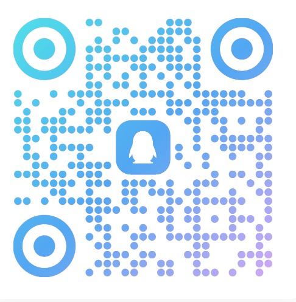

# WorldLines

**Language:** [English](./README.md) · [简体中文](./README.zh.md) · [日本語](./README.ja.md) · [한국어](./README.ko.md)

> **开源部分:** 本仓库中的示例世界与工具 —— AGPL-3.0。可自由 fork、修改并发布你自己的世界。
> **不开源部分:** 引擎核心(`neonrp`)。免费游玩,不可 fork 或再分发。见 [LICENSE](LICENSE)。

<p align="center">
  
  
  
  
  <a href="https://hub.worldlines.gg"></a>
  
  
</p>

<p align="center">
  
</p>

## 概述

**你能用它做什么？**

进入一个会记住你一切行为的世界 —— 在灰雾弥漫的北境港口下达攻防指令，在一列永不停站的黑暗列车上探索每个车厢的秘密，与一位失忆却温柔的治愈师对坐长谈而她真的会记得你说过的每一句话。你可以在几分钟内创建一个世界，设定它的规则、节奏与 NPC，也可以从公开目录中挑选他人创作的世界直接进入。这是实时运行的多智能体社会 —— 不是一对一聊天，是许多 AI 灵魂与你同在一个世界里彼此影响、彼此记住。

它是一台 agentic 模拟引擎。世界 agent 连着地点 agent；每个地点 agent 又连着住在那里的灵魂 agent。这里所有人都是 agent。你通过分身终端走进来。这不是聊天机器人，不是脚本游戏。

> 状态：**v0.2.0 — Hub 上线**（2026-06）· [立即游玩 →](https://hub.worldlines.gg)

---

## 团队与愿景

我们是一支由来自**东京大学**的 PhD 和研究员，以及游戏从业者组成的跨专业（社会学、经济学、图形学、AI Agent、虚拟世界）团队 —— **Ludic Dynamics**。

我们热爱 TRPG（跑团）、galgame 与乙女游戏。当 AI 还没有普及之前，我们长期从事日文文化翻译的志愿者工作，在各种桌面游戏以及游戏图形引擎行业深耕，并曾经协助日本视觉小说作品在 Steam 发行。疫情开始后，我们一头扎进了 AI 角色扮演与叙事类游戏 —— 每个周末、每一个深夜，跑团、搭建世界、追逐那种"故事真的在呼吸"的感觉。

穿越时空在十多个国家之间辗转冒险，在异世界的世界里面探寻它过去的历史，一次一次死去重回某一天只为救回重视的人，辗转在平行时空中找到那唯一的世界线，召唤历史完成一次奔赴理想的战争。

WorldLines 就是这种执念的产物。

> Orchestrated Reality · 编排的真实。通过 Harness 模拟世界与 AI 灵魂 —— 世界具有物理一致性，NPC 具有心智一致性。不要为 agent 写代码。用 agent 来编排世界。

我们通过 harness 构建了「多智能体 × 世界智能体 × 灵魂智能体」系统。我们希望利用这个引擎进行：互动体验创造 · 多智能体社会实验 · Agent 研究推进 · 人格模型与世界模型的 benchmark。

---

## 演示视频

<p align="center">
  <a href="https://youtu.be/oofuC8BSehE">
    
  </a>
</p>
<p align="center"><em>▶ 在 YouTube 观看演示</em></p>

---

## 快速上手

### 🖥️ 下载启动器

下载对应平台的启动器，双击即可安装。无需打开终端。

| 平台    | 文件                  | 下载 |
|---------|-----------------------|------|
| macOS   | `WorldLines.command`  | [最新版](https://worldlines.gg/WorldLines.command) |
| Windows | `WorldLines.bat`      | [最新版](https://worldlines.gg/WorldLines.bat)     |
| Linux   | `WorldLines.sh`       | [最新版](https://worldlines.gg/WorldLines.sh)      |

macOS / Linux 上下载后 `chmod +x` 一次，然后拖到桌面即可。

### ⌨️ 或通过终端安装

```bash
# macOS / Linux
curl -LsSf https://worldlines.gg/install.sh | sh

# Windows（PowerShell）
irm https://worldlines.gg/install.ps1 | iex
```

安装完成后：

```bash
worldlines
```

启动 TUI 界面。从那里你可以创建新世界、浏览目录、或继续之前的存档。

> **首次运行会引导你设置 API。** 密钥保存在 `~/.neonrp/config.json`。[完整提供商指南 →](https://docs.worldlines.gg/docs/getting-started/quickstart)

### 🌐 或者直接在浏览器玩

无需安装。打开 **[hub.worldlines.gg](https://hub.worldlines.gg)**，登录，在浏览器中游玩。

---

## 截图

<p align="center">
  
</p>
<p align="center"><em>游戏画面 — 在雾中抵达石津镇</em></p>

---

## 示例世界

WorldLines 用三种**引擎模式**之一运行世界 —— 它们**不能混用**:

- **fast** —— 一个快速 agent,单一声音。
- **orch** —— 一个 world-agent 编排 domain agent(城镇 / 地下城 / 战斗 / 故事);NPC 是数据。
- **multi-agent** —— 一个 world-agent 包装**独立的灵魂**,每个灵魂是有自己心智、记忆、盘算的角色 agent。标志是有 `souls/` 文件夹。*这是这次的新发布。*

### 👥 multi-agent —— 多个独立灵魂同处一个世界

> **本地运行**(TUI / CLI)。multi-agent 暂未上 hosted play —— 在线只支持 `fast` + `orch`。clone 仓库后用 `neonrp tui --from examples/<world>` 运行。

| 世界 | 灵魂 | 运行 |
|---|---|---|
| **[神楽島 Kagura Island](./examples/multi-agent/kagura-island)** | **7 个** —— 镜子 · 羽 · 真琴 · 宫司 · 白 · 翼 · 悠人。和风悬疑、时间循环、CoC 判定。最丰富的多智能体社会。 | [源码 →](./examples/multi-agent/kagura-island) |
| **[石津镇 · 艾莲娜](./examples/multi-agent/stoneford-elena)** | **2 个** —— Elena(会记住的治愈师)+ Rowan。石津镇世界,住进了活的灵魂。 | [源码 →](./examples/multi-agent/stoneford-elena) · [和 Elena 对话(在线)](https://hub.worldlines.gg/play/souls/elena) |

### ⛩ Stoneford — 旗舰 orch 世界

灰雾北境的河港小镇。经典奇幻 TRPG · d20 骰子 · **10-agent 编排村庄** —— 中心一个 world-agent 路由到城镇、地下城、战斗、故事、NPC agent。**[在线游玩 →](https://hub.worldlines.gg/play/worlds/stoneford)** · **[源码与文档 →](./examples/orch/stoneford)**

### 更多世界

| 世界 | 玩法 | 在线 |
|---|---|---|
| **暗夜列车** | 开放世界 —— 想做什么都行，世界都记着 | [游玩 →](https://hub.worldlines.gg/play/worlds/dark-train) |
| **哥布林遭遇战** | 3 层地下城 —— 逐一击败 3 个哥布林 boss | [源码 →](./examples/orch/goblin-ambush) |
| **世界线收束** | 时间漂移叙事 —— 发短信到过去 | [源码 →](./examples/orch/worldline) |
| **樱坂走廊** | 校园恋爱故事 · 情感叙事 | [源码 →](./examples/orch/sakura-hallway) |
| **引魂灯·盛世缘** | 国风乙女宫廷恋 · 四位皇子 · 一盏认主的灯 · 八种结局 | [源码 →](./examples/orch/otome-lamp) |

所有世界都在 [examples/](./examples/) —— 开源（AGPL-3.0），fork 并发布你自己的。

---

## 使用此引擎的其他项目

- **[Soul Talk](https://hub.worldlines.gg/play/souls/elena)** — 角色对话场景。Elena 会记住你。
- **[Worldline](./examples/orch/worldline)** — 时间漂移叙事引擎。发短信到过去，看时间线重写。
- **即将推出：RP-Abyss** — TRPG 远征。DM + 骰子检定。

---

## 适合谁

### 🎮 AI 角色扮演玩家

你来自 **Character.AI、SillyTavern 或 AI 酒馆**。你喜欢深度的角色对话 —— 但世界总是忘掉你说过的话。

WorldLines 给你有**真实记忆**的角色。她们记得你三天前说过的话。她们有内心独白、意图、目标。而且她们不孤单 —— 她们和其他角色一起活在一个世界里，彼此记住。

→ [玩 Soul Talk](https://hub.worldlines.gg/play/souls/elena) · [把 AI 角色卡带进世界](https://docs.worldlines.gg/docs/guides/sillytavern-import)

### 📖 Galgame · 乙女游戏 · 视觉小说爱好者

你喜欢 **Ren'Py、TyranoBuilder 和分支叙事** —— 但你厌倦了手写每一条路线。你想要故事*回应你*，而不是按预设路线走。

WorldLines 让你设定角色、世界规则和基调 —— agent 会实时生成故事。每一个选择都会激起涟漪。没有两次游玩是一样的。

→ [玩樱坂走廊](./examples/orch/sakura-hallway)(一个校园恋爱故事)· [玩引魂灯·盛世缘](./examples/orch/otome-lamp)(一个国风乙女宫廷恋)· [创建你的第一个世界](https://hub.worldlines.gg/create/world) · *专门的视觉小说开源项目 —— 敬请期待*

### ✍️ TRPG 主持人 · 世界创作者

你在 **Foundry VTT、Discord 或线下** 带团。你花在准备上的时间比实际游玩还多。

WorldLines 是一个 GM 引擎：你设定约束 —— 规则、NPC、基调 —— agent 替你跑世界。自动索引的 lore、每个 NPC 独立的记忆、掷骰裁判 agent。

→ [快速上手](https://docs.worldlines.gg/docs/getting-started/quickstart) · [Stoneford 起始世界](./examples/orch/stoneford)

### 🔬 研究者 —— AI 人格 · 世界模型 · Multi-Agent

你研究人格模型、世界模型 benchmark 或多智能体社会。你需要一个**可复现的沙箱** —— 不是黑盒 API。

WorldLines 是**文件支撑、事件溯源、git-diffable** 的。每个 agent 决策、每次世界状态变化，都是一条纯文本事件，可以追踪、回放、度量。

多人同时游玩还没就绪 —— 但**多智能体村庄**今天就是这个底座:一群可运行、可脚本化、可复现的独立灵魂。`neonrp play` 是 multi-agent 专用运行器,支持脚本化的 JSON + trace 输出:

```bash
neonrp play --project examples/multi-agent/kagura-island                 # 交互式 REPL
neonrp play "..." --project examples/multi-agent/kagura-island --json --trace   # 单次,可脚本化
```

multi-agent 教程即将推出。**有研究需求?[开一个 issue](https://github.com/LudicDynamics/WorldLines/issues) 或邮件 `info@worldlines.gg` —— 我们会配合你的实验。**

→ [Multi-agent 模式](https://docs.worldlines.gg/docs/core-concepts/engine-modes#multi-agent) · [核心概念](https://docs.worldlines.gg/docs/core-concepts/agents-orchestration) · [架构说明](#how-it-works)

### 🛠️ 开发者

你用 **Claude Code、LangGraph 或自定义 agent 管线**。你好奇 world-agent、soul-agent、player-agent 到底是怎么拼到一起的。

我们**还没有把协议开源** —— **world-agent · soul-agent · player-agent** 的架构还在不断迭代。我们不认为有一个完美的答案,正在持续研究更合理的设计。示例世界**是**开源的(AGPL-3.0)—— fork 一个世界、改一个 agent、研究它是怎么接起来的。

如果这正是你感兴趣的问题,**[加入我们的 Discord](https://discord.gg/HJYWbdqWrE)**,和我们一起塑造这个架构。

仓库本身就是个创作工作台:clone 下来用 Claude Code / Codex 打开,`.claude/skills/` 里的创作 skill 会自动加载 —— 看 **[tutorials/](./tutorials/)** 上手做角色卡 / 世界 / soul。

→ [tutorials/](./tutorials/) · [examples/](./examples/) · [架构说明](#how-it-works)

---

## 工作原理

WorldLines 把游戏世界当作文件支撑、事件溯源的状态机。每一回合都是只追加的事件；快照让回溯变得高效。

**Agent 架构（3 层）:**

```
Layer 1: world-agent        — 状态 · 路由 · 叙事 · 归档
Layer 2: town-agent          — NPC、商店、导航
         dungeon-agent       — 探索
         combat-referee      — d20 骰子
         world-builder       — 地图更新
Layer 3:（未来）骰子/规则工具 agent
```

- **文件持久化的记忆与世界状态** — 一切都以纯 JSON 和 Markdown 存在磁盘上。
- **自动索引、自动注入上下文** — 无需手动维护 lorebook。
- **分支 / 撤销 / 重做** — 像 git 分支一样探索叙事分叉。
- **沙箱与回放** — 验证确定性。
- **本地优先模型** — GLM、OpenAI、LM Studio、Ollama。

---

## 教程

**用 Claude Code / Codex 创作（本仓库内,skill 自动加载）—— [tutorials/](./tutorials/)：**

| 我想做 | 教程 |
|---|---|
| 一张角色卡(酒馆兼容) | [01 · 角色卡](./tutorials/01-character-card.md) |
| 一张世界卡 / lorebook | [02 · 世界卡](./tutorials/02-world-card.md) |
| 从零搭一个完整 orch 世界(像樱坂走廊 / 引魂灯) | [03 · 完整世界](./tutorials/03-game-world.md) |
| 一个有独立心智的 soul + 多 agent 世界 | [04 · Soul 与多 agent](./tutorials/04-soul-multi-agent.md) |

完整文档在 **[docs.worldlines.gg](https://docs.worldlines.gg)**：

| 主题 | 链接 |
|---|---|
| 快速开始 | [docs.worldlines.gg/docs/getting-started](https://docs.worldlines.gg/docs/getting-started) |
| 核心概念 | [docs.worldlines.gg/docs/core-concepts](https://docs.worldlines.gg/docs/core-concepts) |
| 指南 | [docs.worldlines.gg/docs/guides](https://docs.worldlines.gg/docs/guides) |
| Q&A / 对比 | [docs.worldlines.gg/docs/qa](https://docs.worldlines.gg/docs/qa) |

---

## 路线图

| 版本 | 状态 |
|---|---|
| **v0.1.9** — 引擎 (2026-04) | ✓ 10-agent 编排器 · Stoneford 起始世界 · Claude Code 运行时 |
| **v0.2.0** — Hub 上线 (2026-06) | ✓ WebHub · 在线游玩 · Soul Talk · 创作工坊 · Stripe · 封面 · 存档 |
| **v0.3.0** — 桌面版 (2026-06) | ◑ Tauri 桌面应用 · 多智能体社会 · 常驻世界 · 支付宝/微信 |
| **v1.0** — 协议 | ○ 稳定 WORLD/SOUL 协议 · 自托管 Web 版 |

完整路线图：[docs.worldlines.gg/docs/roadmap](https://docs.worldlines.gg/docs/roadmap)

---

## 许可证

**开源（AGPL-3.0）：** `examples/` 和 `tools/` 中的示例世界、角色包和工具。（agent 协议/架构还在迭代,尚未开源 —— 见上文「开发者」。）

**不开源：** 引擎核心（`neonrp`）。专有预览版 —— 免费游玩，不可 fork。

## Star 历史

<p align="center">
  <a href="https://www.star-history.com/?type=date&repos=LudicDynamics%2FWorldLines">
    <picture>
      <source media="(prefers-color-scheme: dark)" srcset="https://api.star-history.com/chart?repos=LudicDynamics/WorldLines&type=date&theme=dark&legend=top-left" />
      <source media="(prefers-color-scheme: light)" srcset="https://api.star-history.com/chart?repos=LudicDynamics/WorldLines&type=date&legend=top-left" />
      
    </picture>
  </a>
</p>

---

## 社区

- 官网：[worldlines.gg](https://worldlines.gg) · 文档：[docs.worldlines.gg](https://docs.worldlines.gg)
- Discord：[discord.gg/HJYWbdqWrE](https://discord.gg/HJYWbdqWrE)
- GitHub：[LudicDynamics/WorldLines](https://github.com/LudicDynamics/WorldLines)
- 联系：`info@worldlines.gg`

<p align="left">
  
</p>

---

由 **nikoloside** 与 **redoctober** 开发，[Ludic Dynamics](https://ludicdynamics.com) 持续推进。

特别感谢 `llm-rpg-starter` 前身的早期参与者们：**Amber**、**琛琛**、**Claire**。
