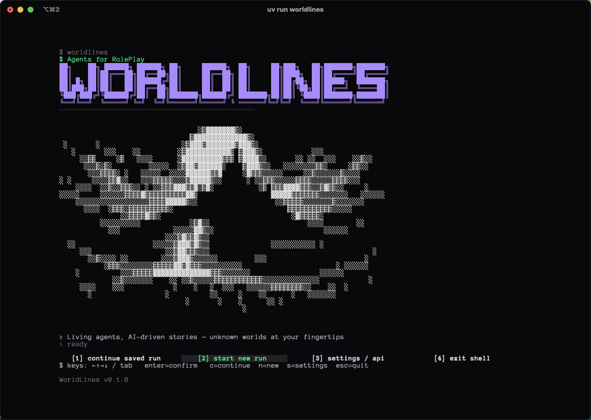

# WorldLines

**Language:** [English](./README.md) · [简体中文](./README.zh.md) · [日本語](./README.ja.md) · [한국어](./README.ko.md)

<p align="center">
  
</p>

<p align="center">
  
</p>

<p align="center"><em>YouTube 预告片 — 即将上线。</em></p>

> 状态：**v0.1.6 stable**（2026-04-25）· 下一站：**v0.2.0**（规划中）

> *Agents for Role Play. Agents for Game. Agents as a Game.*
> 一个文件托底、事件溯源的活世界引擎。

> **我们还非常早期——正在公开搭建中。** WorldLines 正在密集开发。
> 我们会持续开发新的玩法，打磨新的 orchestrating 模式，创作新的模组。
> 与其默默磨到完美，不如早点发出来，跟你一起迭代。

WorldLines 是由 **nikoloside** 与 **redoctober** 共同开发，由
[Ludic Dynamics](https://ludicdynamics.com) 持续推进共创的
Agentic AIRP engine（AI RolePlay engine）。引擎可执行文件代号 `neonrp`，
发行品牌名为 **WorldLines**。

它把游戏世界当作一台带版本、以文件为后端的状态机——让你的每次游玩、
每次编辑、每个 Agent 都变成可复现的产物，而不是转瞬即逝的聊天记录。

---

## 为什么是 WorldLines

传统的"和 AI 聊天"界面会在 context window 填满的那一刻丢失一切。
WorldLines 提供真正的引擎级保证：

- **⭐ 文件持久化的记忆与世界状态。** 记忆、存档、NPC、Agent 全部以
  纯 JSON 和 Markdown 的形式落在磁盘上。没有云端，没有数据库，没有
  隐藏状态。只要你能打开这个文件夹，这个世界就是你的。
- **自动建索引、自动注入上下文。** WorldLines 会自动构建文件索引和
  本地向量数据库，并在每一回合把相关的游戏数据自动注入到 Agent 的
  上下文里。不需要手动维护 lorebook。
- **Event-sourced state。** 每一回合都是 append-only 的 Events，
  Snapshots 让回溯变快。
- **Branch / Undo / Redo。** 像 git 分支那样探索叙事分叉。
- **Sandbox & Replay。** 隔离环境中做实验；校验确定性。
- **Orchestrator 驱动的 multi-agent。** Orchestrator 把路由分发给领域
  Agents（town / dungeon / combat-referee / world-builder / rules-referee），
  它们共享同一份状态。
- **Plan → Diff → Apply。** LLM 输出结构化文件操作，落地前可审阅。
- **Rich TUI。** Claude-Code 风格的对话式终端，游玩与构建共用。
- **Local-first 模型。** GLM、OpenAI、LM Studio、Ollama 都支持。

### WorldLines 与同类产品的对比

|                    | Character.AI     | SillyTavern               | Claude Code             | **WorldLines**                     |
|--------------------|-------------------|----------------------------|-------------------------|-------------------------------------|
| 主要领域            | 角色聊天          | Prompt 前端                | 代码编辑                 | 活的游戏世界                         |
| 世界存在于          | 他们的服务端      | Prompt 配置 + 聊天记录      | 磁盘上的代码库            | **纯文件 + git**                    |
| 记忆与检索          | 云端 / 不透明     | 手动 lorebook              | 代码库检索               | **自动文件索引 + 向量数据库**        |
| 多 agent           | —                 | —                          | 按任务启子 agent          | Orchestrator + 领域 agents           |
| 本地优先的 LLM      | ✗                | 自行接入                    | 仅 API                  | GLM / LM Studio / Ollama             |
| 确定性 / Replay    | —                 | —                          | —                       | **Sandbox + Replay**                 |

Claude Code 是你写代码的 IDE，WorldLines 就是你孕育活世界的 IDE
——记忆、检索、orchestration 都已经内置好了。

> 对每个竞品的完整比较文章见
> [docs.worldlines.gg/docs/qa](https://docs.worldlines.gg/docs/qa)
> （vs Character.AI · vs SillyTavern · vs Claude Code · vs LangGraph · vs OpenClaw）。

> 说明：目前 WorldLines 的 harness 比 Claude Code 更严格——它依赖完整的上下文才能可靠地进行 orchestration。这是为了换取更高的确定性与更易调试的刻意取舍，而不是缺陷。


---

## 安装

### 一行命令

```bash
# macOS / Linux
curl -LsSf https://worldlines.gg/install.sh | sh

# Windows（PowerShell）
irm https://worldlines.gg/install.ps1 | iex
```

会先安装 `uv`（如未安装），再执行 `uv tool install worldlines`。
安装完成后用 `neonrp --help` 或直接 `worldlines` 验证。

### 双击启动器

不想碰终端？下载对应平台的启动器，双击即可。每个启动器会打开一个
终端窗口，执行首次安装（后续启动则自我更新），然后直接交给 TUI：

| 平台    | 文件                  | 下载 |
|---------|-----------------------|------|
| macOS   | `WorldLines.command`  | [最新版](https://worldlines.gg/WorldLines.command) |
| Windows | `WorldLines.bat`      | [最新版](https://worldlines.gg/WorldLines.bat)     |
| Linux   | `WorldLines.sh`       | [最新版](https://worldlines.gg/WorldLines.sh)      |

在 macOS / Linux 上下载后，先 `chmod +x` 一次：

```bash
chmod +x ~/Downloads/WorldLines.command   # 或 WorldLines.sh
```

然后拖到桌面 / Dock，像使用任何其他快捷方式一样使用即可。

### 中国大陆用户

部分大陆网络会限速 GitHub Releases 与 Cloudflare 代理域名。
如果 `curl https://worldlines.gg/install.sh` 超时，可尝试：

```bash
# 直接从 GitHub 拉取（有时比 Cloudflare 跳转更快）：
curl -LsSf \
  https://github.com/LudicDynamics/WorldLines/releases/latest/download/install.sh \
  | sh

# 或强制 uv 使用清华 PyPI 镜像：
export UV_DEFAULT_INDEX=https://pypi.tuna.tsinghua.edu.cn/simple
uv tool install worldlines

# 或一次性同时启用两者：
CHINA_MIRROR=1 curl -LsSf https://worldlines.gg/install.sh | sh
```

自动更新（`neonrp self-update`）会遵循 `UV_DEFAULT_INDEX`，所以
在 shell 配置里导出它，后续升级就会持续走镜像。

### 开发者——可编辑安装

```bash
uv tool install -e /path/to/worldlines
neonrp --help
```

全部安装选项（wheel、源码、替代镜像）见
[docs.worldlines.gg/docs/guides/launcher](https://docs.worldlines.gg/docs/guides/launcher)。

---

## 快速上手

```bash
# 新建目录——只需 /init 就能进入 build 模式
mkdir my-world && cd my-world
neonrp init

# 或者脚手架生成 stoneford 起步模板，直接上头牌样本
neonrp game new --template stoneford

# 启动 TUI
neonrp tui
```

新建项目会自动暴露打包的 builtin skills；`/game new`
是可选的——除非你希望立刻拿到起步世界 + play-agent 脚手架。

> **第一次启动时 launcher 会带你走完整个 API 设置流程。** 已经装了
> **Claude Code (MCP)** 的话直接选它；或为 **Anthropic / OpenAI /
> DeepSeek / OpenRouter / [GLM 免费额度](https://zhipuai.cn)** 粘贴 key；
> 或指向本地的 **Ollama / LM Studio**。key 会自动保存到
> `~/.neonrp/config.json`，之后可随时从 `[3] settings / api` 修改。
> [完整 provider 指南 →](https://docs.worldlines.gg/docs/getting-started/quickstart)

输入 `look around` 并回车。这就是你的第一个 agentic 回合。

<p align="center">
  
</p>

10 分钟完整流程见
[docs.worldlines.gg/docs/getting-started/quickstart](https://docs.worldlines.gg/docs/getting-started/quickstart)。

---

## 文档

完整文档在官网——此仓库只保留入口。

| 主题                | URL                                                                              |
|---------------------|----------------------------------------------------------------------------------|
| 快速上手            | [docs.worldlines.gg/docs/getting-started](https://docs.worldlines.gg/docs/getting-started) |
| 核心概念            | [docs.worldlines.gg/docs/core-concepts](https://docs.worldlines.gg/docs/core-concepts)（Worlds · 角色 & Multi-Agent · Agents & 编排 · 引擎模式 · Sessions · 记忆系统） |
| 指南                | [docs.worldlines.gg/docs/guides](https://docs.worldlines.gg/docs/guides)（Launcher · 世界生命周期 · SillyTavern 导入 · Discord 教程） |
| Q&A / 对比          | [docs.worldlines.gg/docs/qa](https://docs.worldlines.gg/docs/qa)（vs Character.AI · vs SillyTavern · vs Claude Code · vs LangGraph · vs OpenClaw） |
| 更新日志 & 路线图   | [docs.worldlines.gg/docs/changelog](https://docs.worldlines.gg/docs/changelog) |

**本仓库内：**

- [templates/stoneford-worldlines/](templates/stoneford-worldlines) — 示例世界与 Agents（submodule）
- [CONTRIBUTING.md](CONTRIBUTING.md) — 如何贡献
- [SECURITY.md](SECURITY.md) — 如何报告安全问题
- [CODE_OF_CONDUCT.md](CODE_OF_CONDUCT.md) — 社区行为预期
- [LICENSE](LICENSE) — 闭源预览条款

## 社区与联系方式

- 官网：[worldlines.gg](https://worldlines.gg) · 文档：[docs.worldlines.gg](https://docs.worldlines.gg)
- Discord：[discord.gg/HJYWbdqWrE](https://discord.gg/HJYWbdqWrE) · Patreon：[patreon.com/cw/WorldLines](https://www.patreon.com/cw/WorldLines) · QQ 群：扫描下方二维码
- GitHub：[LudicDynamics/WorldLines](https://github.com/LudicDynamics/WorldLines)
- 联系邮箱：`info@worldlines.gg`

<p align="left">
  
</p>

---

## 版权与鸣谢

Copyright © 2026 **nikoloside**, **redoctober**。保留所有权利。

WorldLines 是一款闭源引擎，仅以预览形式发布供评估使用。未授予任何用于
再利用、再分发或衍生作品的许可。完整条款见 [LICENSE](LICENSE)。

由 **nikoloside** 与 **redoctober** 开发与维护，并由 Ludic Dynamics
社区持续运营、实验与推进。特别感谢 `llm-rpg-starter` 前身的早期
参与者（Ludic Dynamics 社区）的慷慨的激烈讨论、交流、合作和支持：
**Amber**、**琛琛**、**Claire**。

*WorldLines 与 Ludic Dynamics 是 Ludic Dynamics 的商标。*
