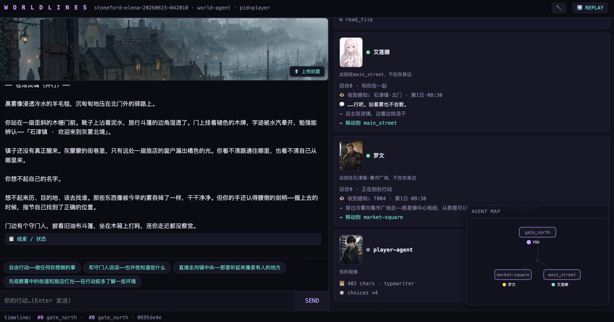

# 🌿 Stoneford · Elena — マルチエージェント・ワールド

**Language:** [English](./README.md) · [简体中文](./README.zh.md) · [日本語](./README.ja.md) · [한국어](./README.ko.md)

> エンジンモード:**multi-agent**。Stoneford の世界に、生きたソウル —— **Elena** と **Rowan** —— が宿る。彼らは自ら考え、覚え、行動する。

> **遊び方（推奨）:** **WorldLines Launcher** を開く → **新規ゲーム** → **Stoneford · Elena** を選ぶ → キャラクターを選ぶ → **ブラウザ · Web** —— ブラウザで一人ひとりのソウルが同時に生きる様子を見られます。CLI なら `neonrp web --project examples/multi-agent/stoneford-elena`。**multi-agent はブラウザ（`neonrp web`）が一番。TUI は使わないでください。** Elena にはホスト版の soul 会話デモもあります:**[Elena と話す →](https://hub.worldlines.gg/play/souls/elena)**

<p align="center">
  
</p>
<p align="center"><em>ブラウザプレイ（<code>neonrp web</code>）—— world-agent が語り、Elena と Rowan がそれぞれ知覚・移動・行動し、エージェントマップが誰がどこにいるかを示す。</em></p>

## なぜ multi-agent なのか

`fast` と `orch` モードは **world-agent + ドメイン agent**（町・ダンジョン・戦闘）を動かします。NPC はオーケストレータが代弁するデータです。

**multi-agent** は `souls/` フォルダを追加します。各ソウルは**独立したキャラクター agent** で、固有のペルソナ・記憶・秘密・目標を持ち、自分で考えます。ランタイムはソウルラッパーに入ります:

```
world-agent  →  active souls (Elena, Rowan)  →  world-agent
  (主権的       各ソウルが自分で                  (ターンを閉じ、
   編成者)       発話 / 行動 / 内なる声を決める)     あなたへ叙述)
```

ソウルは隔離されたアクター —— フォルダを共有せず、世界状態を所有しません。Elena は3セッション前のあなたの言葉を覚えており、Rowan はあなたがいてもいなくても自分の目的を追います。これが**村 / 社会**モデルの実践です。

```bash
neonrp web --project examples/multi-agent/stoneford-elena
```

## ソウル

| Soul | 誰 |
|---|---|
| **Elena**（`elena-si-elena0001`） | 覚えている癒し手 —— 温かく、鋭く、自身の過去を抱える |
| **Rowan**（`rowan-si-rowan0001`） | 自分の動機、自分の時間線を持つ |

各ソウルフォルダはバンドル構造に従います:`soul.json` / `soul.md`（identity）、`persona/`（特性・価値・関係）、`background/`（歴史・出自・秘密）、`character/`（プロフィール・ステータス・所持品）、`long-term-memo/` + `short-term-memo/`（記憶）、`rules/`（ソウルごとのガードレール）、`agents/`（ソウルの 6-agent の心）、`trajectory/`（生きてきた軌跡）。

## 世界

Stoneford orch ワールドの上に構築（`agents/` = world-agent + 町 / ダンジョン / 戦闘 / 物語 / world-builder / rules / clock / evolution / character agent）、`game/` が世界の真実を保持。ソウルはその上に生きます。

## ライセンス

**AGPL-3.0** —— フォーク、改変、自分の世界を出荷可能。エンジン（`neonrp`）はプロプライエタリプレビュー。
