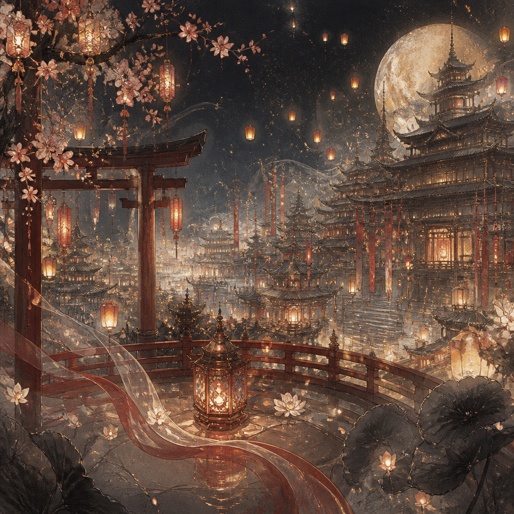

# 引魂灯·盛世缘 · Lamp of Souls



天启年间，大胤王朝鼎盛。入宫的第一夜，你这名出身寒微的女官误入禁苑，
点亮了传说中的**引魂灯**——它认你为主。蓝焰一盛，凉亭里四道身影同时回头：
太子、二皇子、三皇子、五皇子，大胤最尊贵的四位皇子，正各怀心思地看着你。

在灯火燃尽之前，在权谋与情丝里，你能否为自己择一条生路、择一个人？

这是一个**国风乙女**情感叙事世界。宫墙、禁苑、引魂灯阁。没有战斗，没有掷骰。
只有话里有话的试探、欲言又止的留白，和一段一旦动心就难全身而退的情劫。

**基调：** 华丽而暗流涌动，浪漫中夹着权谋机心 —— 情丝、心迹与记忆的交错，
人与人之间真假难辨的牵绊。

## 看点

- **情感驱动的叙事 agent**：world-agent 根据每位皇子的**情丝**、宫廷时间线与
  引魂灯渐弱的**灯火**推进故事；不是战斗系统，是「情丝系统」。
- **四位攻略对象，一盏认主的灯**：温润太子、腹黑二皇子、赤诚三皇子、通灵幼皇子，
  各有声口、隐秘与软肋。
- **三处命运抉择 × 八种结局**：第 2 / 4 / 7 夜各有一处不可回避的立场抉择
  （沉默或告密、接受或婉拒、屈服或抗命），组合出从「灯灭人散」到「双灯同辉」的八种收束。
- **心迹四轴**：忠诚／坦诚／奉献／信任，悄悄记下你是个怎样的人——背叛过的人会被猜疑，
  坦诚过的人会被托付。
- **记忆与回响**：每一句有分量的话都被记住。皇子会在很久以后提起你那夜在凉亭说过的话。

## 世界观

大胤王朝万邦来朝，皇宫禁苑深处藏着一盏**引魂灯**，能认主、能牵动国运，
也能映照人心真假。你因点亮此灯而卷入四位皇子的情与谋。每一次抉择，
都关乎自身安危与情缘走向——也关乎这盏灯，最终为谁而明。

## 角色

- **萧景琰（太子）** — 温润如玉、肩负社稷的嫡长子，见你第一夜便一见倾心；
  他知晓引魂灯的秘密，也怕它把你卷进他保不住的局。
- **萧景桓（二皇子）** — 城府极深的野心家，刻意接近你以掌控引魂灯；
  偏偏在你识破他仍敢回望时，动了真心。
- **萧景瑜（三皇子）** — 骁勇寡言的武将，只会用行动护人；
  剑匣底下压着一叠能定他人生死、却不知该不该呈上的证据。
- **萧景玥（五皇子）** — 醉心音律的幼皇子，天生通灵，能听见引魂灯的「声音」；
  也最先记住了你身上、连灯都没有的暖。

> 立绘说明：女官（主角）立绘为本作专属；四位皇子暂用占位立绘
> （`assets/placeholder.png`），后续替换为各自专属画稿。

## 怎么玩

```
neonrp tui --from examples/orch/otome-lamp/zh
```

或导入 hub 游玩。每次进入都可能落在不同的时间线节点；灯火渐弱，抉择不可回头。

---

*这是一个 **orch（编排）** 模式的世界：world-agent 作旁白主控替四位皇子发声、
推进灯火与抉择，并调用 `@heart` 子 agent 做结构化情丝判定。结构与
[樱坂走廊](../sakura-hallway/) 同源，是国风乙女题材的范本。*
