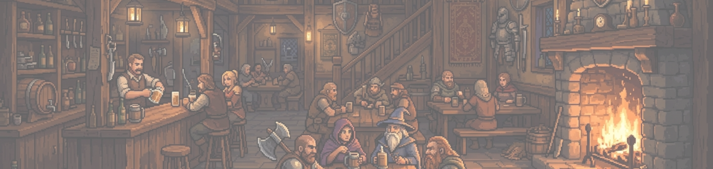

# ⛩ 石津镇 Stoneford — WorldLines 旗舰世界

**Language:** [English](./README.md) · [简体中文](./README.zh.md) · [日本語](./README.ja.md) · [한국어](./README.ko.md)



> 灰雾北境的河港贸易小镇。经典奇幻 TRPG · d20 骰子 · **10-agent 多智能体村庄**。

石津镇是 [WorldLines](https://github.com/LudicDynamics/WorldLines) 自带的旗舰示例 —— 一座完整可玩的小镇,有 NPC、任务、地下城和攻防机制,由一个多智能体社会编排运行。

**[▶ 在线游玩(无需安装)→](https://hub.worldlines.gg/play/worlds/stoneford)**

## 怎么玩

```bash
# 本地 TUI
neonrp tui --from examples/stoneford

# Claude Code / MCP —— 在本目录里打开 Claude Code
@world-agent 开始游戏
```

## 村庄 —— 一个多智能体社会

石津镇是一座**活的村庄**:中心一个 `world-agent` 编排一群领域 agent,每个掌管世界的一部分。只有 world-agent 有 trigger;其余 agent 都由它通过 `task()` 调度,各有独立上下文。

```
world-agent（编排器）             — 读状态 · 路由 · 合并 patch · 叙事 · 归档
├── rpg-world-builder             — 世界地图、区域、势力
├── rpg-story-narrative           — 主线故事 + 传闻
├── rpg-town-agent                — 城镇导航、NPC、商店、公会、旅店
├── rpg-dungeon-agent             — 地下城探索
├── rpg-combat-referee            — d20 战斗判定
├── rpg-rules-referee             — 规则查询与检定
├── rpg-clock-keeper              — 时间、日程、世界时钟
├── rpg-world-evolution           — 世界的长期演变
└── rpg-character-agent           — NPC 心智:意图、记忆、对话
```

这就是**村庄结构**的实践:世界会记住,NPC 有自己的心智,每一回合都是一个被编排的 agent 社会,而不是一次单独的 prompt。

## 世界内容

- **T001 石津镇** —— 起点:公会、杂货、旅店、码头
- **T004** —— 第二个聚落:礼拜堂、鉴定师、草药铺、酒馆
- **D001 苔墓地穴** —— 4 房间地下城
- **任务** —— 雾中失踪者 · 苔墓前的狼嚎 · 商队护卫
- **战斗** —— d20 + 属性修正 + 状态效果

<p align="center">
  
</p>

## 关键文件

| 文件 | 作用 |
|------|------|
| `game/agents/manifest.json` | 10-agent 清单（id、角色、读写范围） |
| `game/meta/run_state.json` | 世界状态（位置、时间、上次行动） |
| `game/meta/game-start.json` | 开场引导（开场叙事 + 初始读取列表） |
| `game/towns/*/` | 城镇数据:NPC、任务、设施、地图 |
| `game/dungeons/D001/` | 地下城布局、房间、遭遇与战利品表 |
| `game/rules/combat_rules.md` | d20 战斗规则 |
| `agents/*/` · `.claude/agents/*` | agent 定义（TUI + Claude Code 镜像） |

## 许可证

石津镇为 **AGPL-3.0**。fork、修改、发布你自己的世界。运行它的 WorldLines 引擎（`neonrp`）是专有预览版。

> *石津镇是由 **nikoloside**、**redoctober** 与 Claude 共同创作的原创设定,融合了东方世界观与西方中世纪魔法。*
